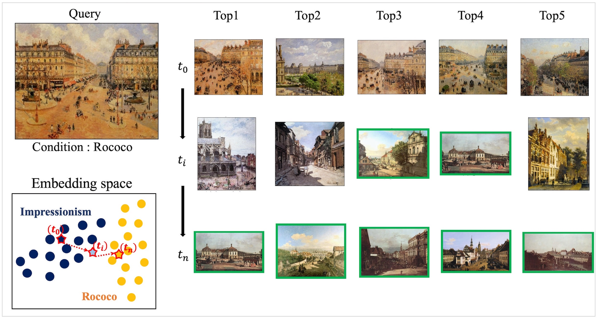
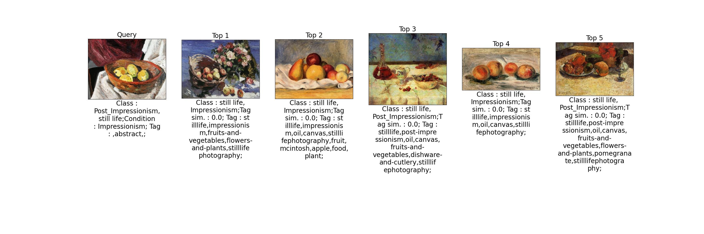

# Backward Inductive Deep Neural Image Search

  

Figure 1: Overview of the proposed conditional image retrieval method on the WikiArt dataset. 
t_0 is initial image retrieval results, and t_n is 'pop art' conditioned image retrieval results. 
Our proposed method updates embedding vectors t_0 to t_n through t_i by exploring embedding space.
We highlight with a green box when the retrieved image has same class as condition.

### Abstract
Content-Based Image Retrieval (CBIR) is essential in computer vision research.
With the development of deep neural networks, digitized images can be effectively represented as low-dimensional features.
As a result, Deep neural network based CBIR has demonstrated strong performance in image retrieval. Specifically,
Composed Images Retrieval (CoIR) to reflect the specific search intention of users has shown promising results. 
However, in many cases, CoIR models require a large number of images and relational caption triples for the training model. 
This study proposes a new method of conditional Image retrieval. It provides a method to find embedding vectors 
for not only a query but also explicit conditions of the user’s intent by an inverse mapping approach. 
As a result, features of the original query are updated to a new point of the latent space so as to conform to the conditions.
To evaluate the performance of our method, we conducted experiments using WikiArt, aPY, and CUB benchmark categorical datasets.
Our method was compared with CoIR methods, and we found that it outperforms zero-shot-based models.

### Dependency
All experiments were conducted using Ubuntu 22.04 as the OS with Nvidia RTX 3090 and AMD Ryzen 5900. Utilized 
programming language was Python 3.9. PyTorch 2.0.1+cuda and torchvision 0.15 are used for 
deep learning framework. In addition, Matplotlib 3.5.0 , numpy 1.24, pandas 1.3, scikit-learn 1.3.2, 
were used for data processing and visualization. Pre-trained weight for our encoder backbone 
model was obtained with torchvision.
Our Python Packages requirments are written in **requirments.txt** 

### Install Packages
~~~
pip install -r requirements.txt
~~~

## Dataset Preparation  
___
### 1. Download Dataset
We used the Caltech-UCSD Birds-200-2011 (CUB), Attribute Pascal and Yahoo (APY), and WikiArt datasets for our experiments.
The `CUB` dataset can be downloaded from https://www.vision.caltech.edu/datasets/cub_200_2011/.
For the `APY` dataset, the official link is https://vision.cs.uiuc.edu/attributes/. However, the download link seemed to be currently down. As an alternative, We downloaded the APY dataset from   
https://github.com/BatsResearch/mazzetto-neurips22-code. Finally, the `WikiArt` dataset was downloaded from https://huggingface.co/datasets/huggan/wikiart
   
We provide our dataset that has already been pre-processed to resize images, split the dataset and rearrange label list
Our pre-processed Data URL : https://drive.google.com/file/d/1FQGeDeeBLXrlQQ-4bv4sjApUvbku7kXX/view?usp=sharing 

### 2. Dataset Preprocessing 
Run code `A1.Data-Proprocessing-[dataset].py` for data preprocessing
~~~
python A1.Data-Preprocessing-APY.py
python A1.Data-Preprocessing-CUB.py
python A1.Data-Preprocessing-wikiart.py
~~~

### 3. Generate test query 
Run the code `A2.Query-Generating.py` to generate the test query. since we have fixed random seeds 
for generating the test query so the result will be the same.
~~~
python A2.Query-Generating.py 
~~~

Below table is data structure for reproducing our model
~~~
+-- ./data
|   +-- wikiart
|   |   +-- attributions
|   |   |    +--- wikiart_attributions.csv
|   |   |    +--- preprocessed_wikiart_train.csv
|   |   |    +--- preprocessed_wikiart_test.csv
|   |   |    +--- query_style_wikiart_test_random.pkl
|   |   |    +--- ...
|   |   +-- images
|   |   |    +--- Impressionisiom
|   |   |    |    +--- art-painting-work-img.jpg
|   |   |    |    +--- ...
|   |   |    +--- Realism
|   |   |    +--- ...
|   +-- CUB
|   +-- APY
+-- ./weight
+-- ./src
+-- ...
~~~
&nbsp;

## Train model
### 1. Proposed Models
We trained our proposed model with `resnet50`, `vgg16_bn`, `vit_b` and `convnext_base` as backbone of encoder module.    
- Default backbone of our model is `convnext_base` and enbedding size is `256`. more detailed implementations are described in our paper

~~~
# wikiart dataset
python B1.BuildModel.py --encoder_model convnext_base --encoding_size 256 --dataset_name wikiart --category_type stylegenre
# CUB dataset
python B1.BuildModel.py --encoder_model convnext_base --encoding_size 256 --dataset_name CUB --category_type birds
# aPY dataset
python B1.BuildModel.py --encoder_model convnext_base --encoding_size 256 --dataset_name APY --category_type category
~~~

## Infer with trained models  (***Extract Latent Embedded Vector***)
___
### Extracting embedding from the benchmark dataset using the trained model
~~~
# wikiart dataset
python C1.ModelTest.py --encoder_model convnext_base --encoding_size 256 --dataset_name wikiart --category_type stylegenre
# CUB dataset
python C1.ModelTest.py --encoder_model convnext_base --encoding_size 256 --dataset_name CUB --category_type birds
# aPY dataset
python C1.ModelTest.py --encoder_model convnext_base --encoding_size 256 --dataset_name APY --category_type category
~~~
&nbsp;

## Train Knowledge Distillation Model
___
### Training Knowledge Distillation Model
Since the code requires extracted embeddings, `C1.ModelTest.py` should be fully executed.
~~~
# CUB dataset with a bird class condition
python D1.Train-KD-Model.py --encoder_model convnext_base --encoding_size 256 --dataset_name CUB --category_type birds --inverse_lambda 0.51

# APY dataset with a category class condition
python D1.Train-KD-Model.py --encoder_model convnext_base --encoding_size 256 --dataset_name APY --category_type category --inverse_lambda 0.7

# WikiArt dataset with a style class condition
python D1.Train-KD-Model.py --encoder_model convnext_base --encoding_size 256 --dataset_name wikiart --category_type stylegenre --inverse_lambda 1.1

# WikiArt dataset with a style and genre class conditions
python D1.Train-KD-Model.py --encoder_model convnext_base --encoding_size 256 --dataset_name wikiart --category_type stylegenre --num_condition 2 --inverse_lambda 3.2
~~~

&nbsp;

## Get Trained Weight and Extracted Embeddings of Our Paper 
We provide download URL of our trained weight and all inference results as follow :    
URL : https://drive.google.com/file/d/18yTX6uaj5xDVJgNYL0N8pC45Z5SxbsVX/view?usp=sharing
&nbsp;

## Evaluation of CIR

### 1. Backward Search Result
In this paper, we evaluated Backward Search on the wikiart, aPY and CUB benchmark datasets. As the experiment result shows in our paper, 
We set the lambda of the regularization term to 0.51 (CUB), 0.7 (aPY), 1.1(wikiart-style), and 3.2 (wikiart-multi)

~~~
# APY dataset with a bird class condition
python E1.Model-Evaluation.py --encoder_model convnext_base --encoding_size 256 --dataset_name CUB --category_type birds --inverse_lambda 0.51

# CUB dataset with a category class condition
python E1.Model-Evaluation.py --encoder_model convnext_base --encoding_size 256 --dataset_name APY --category_type category --inverse_lambda 0.7

# WikiArt dataset with a style class condition
python E1.Model-Evaluation.py --encoder_model convnext_base --encoding_size 256 --dataset_name wikiart --category_type stylegenre --num_condition 1 --inverse_lambda 1.1

# WikiArt dataset with a style and genre class conditions
python E1.Model-Evaluation.py --encoder_model convnext_base --encoding_size 256 --dataset_name wikiart --category_type stylegenre --num_condition 2 --inverse_lambda 3.2
~~~

### 1. Knowledge Distillation Model Result
To evaluated the `Knowledge Distillation Model` of our proposed `backward Search` method run the following code.   

~~~
# APY dataset with a bird class condition
python E1.Model-Evaluation.py --encoder_model convnext_base --encoding_size 256 --dataset_name CUB --category_type birds --inverse_lambda 0.51 --evaluation_distill True

# CUB dataset with a category class condition
python E1.Model-Evaluation.py --encoder_model convnext_base --encoding_size 256 --dataset_name APY --category_type category --inverse_lambda 0.7 --evaluation_distill True

# WikiArt dataset with a style class condition
python E1.Model-Evaluation.py --encoder_model convnext_base --encoding_size 256 --dataset_name wikiart --category_type stylegenre --num_condition 1 --inverse_lambda 1.1 --evaluation_distill True

# WikiArt dataset with a style and genre class conditions
python E1.Model-Evaluation.py --encoder_model convnext_base --encoding_size 256 --dataset_name wikiart --category_type stylegenre --num_condition 2 --inverse_lambda 3.2 --evaluation_distill True
~~~

## Visualization Example
We provide a code to visualize the result of our test query set
~~~
# APY dataset with a bird class condition
python E2.Model-Query-Visualization.py --encoder_model convnext_base --encoding_size 256 --dataset_name wikiart --category_type stylegenre --inverse_lambda 1.1 --query_key 100
~~~
Example of visualization result on WikiArt dataset
  

